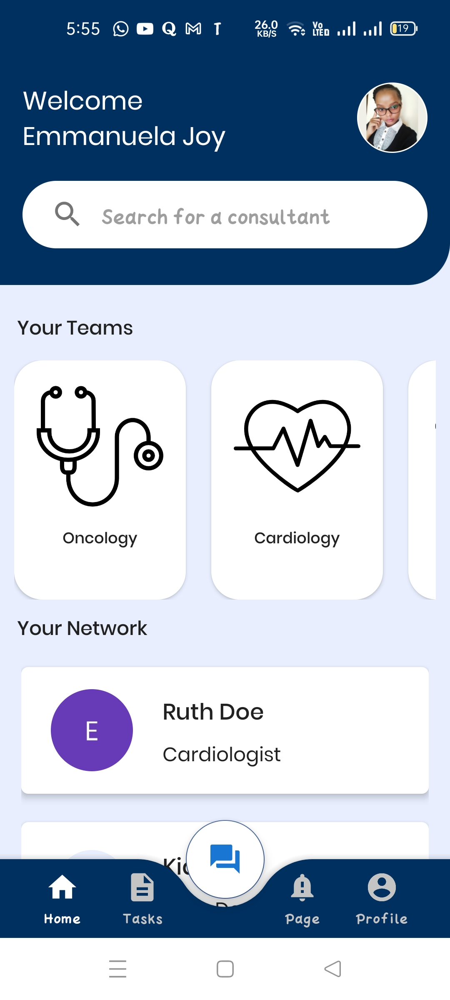

# Consult

## Project Description

Consult is an application created to facilitate communication between healthcare workers and enable them to collaborate easily by bringing all clinical communications into one platform.

## APP FEATURES

1. Communication Feature

- This feature offers the physicians a centralized chat page which allows for direct consultations between physicians, creation of multidisciplinary teams to discuss cases as well as offering a medical directory for all physicians in the facility.

2. Task Feature

- This feature offers the physicians an inbuilt calendar that shows the days events, meetings and pending assignments.

3. Alert Feature

- This feature enables the physician to alert/page their fellow colleagues.

{:height="36px" width="36px"}

## Contributors

[Emmanuela Joy](https://github.com/EmmanuelaJoy) - Scrum Master & Android Developer

[Lilian Kamau](https://github.com/lilianjerikamau) - Android Developer

[Inez Mugure](https://github.com/Mugure-Inez) - Android Developer

## Technologies Used:

- Java
- Android SDK.
- Gradle.
- Material Design.
- JUnit.
- Firebase RealTime Database
- Firebase FireStore
- Firebase Cloud Messaging

## [License](https://github.com/EmmanuelaJoy/Dr-Little/blob/main/LICENSE)
